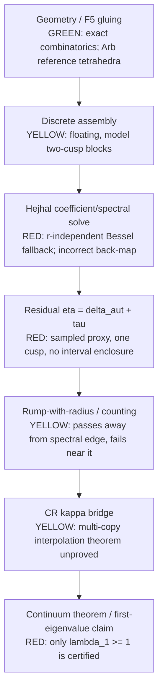

# Dual-certification diagnosis

Scope: `C:\Users\Admin\.grok\worktrees\bearings-bianchi-selberg\np9\dual_certification_` only.  This is a diagnosis, not a new certificate.  Numerical values below were regenerated at `M=28`, `r=6.7439020359331625`, `Y0=0.8`, and face grid 16 by `dual_certification_audit.py`; the raw machine record is `dual_certification_audit_result.json`.

## Verdict

The reported `eta ~= 0.037` plateau is **not a mathematical or Fourier-truncation plateau**.  It is principally an implementation artifact: the installed SciPy `kve` does not accept an imaginary order.  Both Hejhal assemblies catch that error and substitute the elementary Lemma-K *upper bound*, which is independent of `r`.  Consequently their matrix, weights, and right singular vector are independent of the spectral parameter.  A direct independent comparison of the assembled two-cusp matrices at `r=6` and `r=8` gave exactly

```
relative_mid_change_r6_to_r8 = 0.0
weight_relative_change       = 0.0
```

Thus golden-section refinement of `r` cannot reduce the measured face defect.  The unchanged `delta_aut=0.03611603886721923` in all three recorded outer iterations is the expected consequence.

This does **not** mean that evaluating the correct Bessel functions will reach the target.  The current matrix is also a stated model rather than the group-equivariant two-cusp Hejhal system, and the reported residual is not an interval enclosure of the residual required by Theorem D(K).  Therefore no existing number establishes any valid distance to `eta_0`.

## Dependency graph and status



The green geometry and the previously certified FEM exclusion of `(0,1)` remain useful, but they do not repair the red Hejhal/residual link.  The theorem layer is conditional on H, A, S and on a genuine sufficiently small residual; it cannot turn a model floating proxy into a certificate.

## Root cause, with reproducible evidence

### 1. The Bessel fallback erases spectral dependence (primary root cause)

`hejhal_conditioning.py:106-127` and `two_cusp_hejhal_N5.py:98-112` call `scipy.special.kve(1j*r,x)` inside a broad `try/except`.  If it fails they return

\[
\sqrt{\pi/(2x)}e^{-x},
\]

an upper bound from Lemma K, not (K_{ir}(x)).  It contains no `r`.

An independent direct call in this environment raises

```
TypeError: ufunc 'kve' not supported for the input types
```

so the fallback path is always taken.  A 60-decimal `mpmath.besselk(1j*r,x)` cross-check at `r=6.743902...` found the implemented amplitude larger than `|K_ir|` by factors 126.84 at `x=5.02655`, 25.20 at `x=7.10861`, and 2.34 at `x=26.59799`.  The agreement of two independent formulas for the `S` action was exact on two nontrivial points; the pullback formula is not the cause of this particular plateau.

The elementary Lemma-K bound is legitimate for a tail *upper bound*.  It is not a substitute for the Bessel value in a numerical trial function or collocation matrix.

### 2. The current two-cusp operator is explicitly a model

`two_cusp_hejhal_N5.py:191-220` forms a height-matched pullback: it computes the actual pulled-back amplitude only to make a radius, then deliberately puts the original `w_match` into the midpoint.  `build_S_coupling` (`:223-268`) labels the coupling a “model”, choosing a diagonal/off-diagonal decay and an ad hoc phase.  `build_block_system` (`:303-308`) additionally makes the system nonsingular by adding `reg ~= 1e-8` to both diagonal blocks.

These choices rule out a theorem that the near-kernel represents a Fourier expansion satisfying the actual cusp transition and pairing relations.  They explain why changing a scalar `r` in this model is not a meaningful Hejhal iteration even after the Bessel backend is repaired.

### 3. The SVD vector is not mapped back through the stated preconditioner

For `G = mid * D^{-1} * diag(1/col)`, a right singular vector `u` of `G` must be converted to physical coefficients through both `D^{-1}` and `diag(1/col)`, plus the equilibration diagonal factors if the SVD was taken after equilibration.  `production_hejhal_residual.py:65-80` computes its SVD after `equilibrate(G)` but returns `a_full = u / col`; it neither retains equilibration scales nor applies `D^{-1}`.

At the recorded iterate this is quantitative, not cosmetic:

| vector / residual definition | relative residual |
|---|---:|
| reported vector in physical `mid` | 3.900e-1 |
| reported vector in un-equilibrated `G` | 8.489e-3 |
| independently back-mapped right singular vector of `G` in `mid` | 4.279e-9 |
| coefficient overlap: reported vs correct-`G` vector | 1.781e-2 |

The last row proves the face residual is evaluated on a substantially different vector than the linear solve selected.  The `4.279e-9` number only validates linear algebra for the **model midpoint**; it is not an automorphy certificate.

## Decomposition of the recorded eta plateau

The saved outer iteration's best row has `delta_aut=0.0361160`, `tau_proxy=0.00078517`, and `eta_proxy=0.0369012`.  Therefore face defect supplies 97.87% of the reported eta.  The maximum-based definition means that `S`, rather than a sum over relations, dominates:

| relation, after the recorded periodize + reproject step | max normalized jump | RMS normalized jump |
|---|---:|---:|
| `T1` | 4.13e-16 | 2.10e-16 |
| `R` | 3.2578e-2 | 2.2283e-2 |
| `TiR` | 3.2578e-2 | 2.2283e-2 |
| `S` | **3.6116e-2** | 1.9040e-2 |

For the current (pre-reprojection) two-cusp vector, the infinity-cusp periodized defect is 0.16115 while the unmeasured zero-cusp defect is 0.54842.  `hejhal_iterate.py:147-166` reprojects only `a_inf`; it does not update or test `a_0`.  `production_hejhal_residual.py:114-127` similarly labels the infinity-cusp measurement “primary” and uses it alone in `eta`.

The requested before/after diagnostics are:

| operation | infinity-cusp `delta_aut` |
|---|---:|
| raw Fourier field, before reproject | 6.5112e-1 |
| finite horizontal periodization, before reproject | 1.6115e-1 |
| raw Fourier field, after reproject | 1.6115e-1 |
| finite horizontal periodization, after reproject | **3.6116e-2** |

`eval_fourier_periodized` defaults to a finite horizontal set (`id`, translations, rotations) and explicitly does not include `S` (`delta_aut_pairing.py:70-81,181-221`).  Thus this is a useful diagnostic projection but not a group periodization or a proof that the `S` relation is controlled.

Per-basis and per-Fourier-norm data are in the JSON.  The leading coherent contributions for both `R/TiR` and `S` are norm 1, then norm 2; norms 4, 5, and 8 are already one to five orders smaller in this *fallback-weighted model*.  This is evidence against high modes being the observed 0.037 bottleneck, but it gives no evidence about truncation under correct (K_{ir}) coefficients.

## Conditioning and precision audit

At the same point the main matrices have:

| operator | shape | smallest singular value | condition number | numerical nullity at `1e-12` |
|---|---:|---:|---:|---:|
| physical model `mid` | 176x176 | 4.429e-11 | 2.371e8 | 0 |
| amplitude-preconditioned | 176x176 | 2.266e-3 | 5.351e6 | 0 |
| plus column normalization | 176x176 | 1.301e-4 | 6.455e4 | 0 |
| equilibrated, reported solve | 176x176 | 2.443e-3 | 8.683e3 | 0 |
| face-jump-only matrix | 64x88 | 2.341e-26 | 3.408e23 | 57 |

The amplitude dynamic range is `3.930e8`; interval radii have Frobenius norm 34.38% of the midpoint Frobenius norm.  Preconditioning is essential, but the unequilibrated physical condition number gives a rough double-precision scale `eps*kappa ~= 5e-8`, already comparable with the optimistic `6.37e-8` target.  Conditioning is therefore a certification obstacle, but it does not explain the O(1e-2) plateau; r-independence does.

The jump-only nullity independently confirms the comment in `delta_aut_pairing.py:328-332`: face constraints alone cannot define the coefficient vector.  A valid solve needs a mathematically exact coupled equation, not the present hybrid/model pin.

## Other certification blockers

| stage | color | exact failure | smallest provable improvement |
|---|---|---|---|
| Hejhal Bessel evaluation | RED | non-rigorous fallback changes the trial function and removes `r` | use a verified (K_{ir}(x)) evaluator with outward interval enclosure; fail closed if unavailable |
| assembly / cusp transition | RED | height-matched midpoint, modeled `S`, artificial regularization | derive every block from actual scaling matrices and pairings; enclose every entry and remove/rigorously account for regularization |
| eta | RED | sampled max jump, proxy tau, only infinity cusp, no tail/face quadrature enclosure | interval-enclose both cusp residuals, each pairing face, truncation tail, and reprojection error; define an L2/H1 norm matching D(K) |
| Rump radius | YELLOW | at `t=16.7501`, `lambda_min=0.001444 < radius floor=0.004622` | reduce interval matrix radii below the certified spectral margin (finer elements/Taylor subdivision and a sharp verified spectral-norm bound) |
| CR kappa bridge | YELLOW | κ1 interpolation theorem not proved on the six-copy glued periodic space | prove the conforming/glued CR interpolation estimate with the exact weighted form and boundary identifications |
| continuum GLB | RED | depends on that missing bridge | after the bridge, replay all Arb mesh/metric hypotheses; until then retain only FEM `lambda_1 >= 1` |
| counting | YELLOW | no certified `N(lambda)=[0,0]` between exclusion floor and target | validated interval counting/Lehmann-Goerisch-style argument that includes multiplicity and the quotient boundary conditions |
| theorem inputs | YELLOW | H, A, S are assumptions, not established in this pipeline | either prove/provide certified constants for the chosen trial family, or retain the theorem's conditional language |

The Rump failure near the edge is a genuine interval-radius-versus-margin failure, not floating-point pessimism: the recorded radius exceeds the midpoint margin by about 3.18e-3.  The green Arb geometry is independent of, and does not imply, the missing κ bridge.

## Threshold consistency

`C1_AUDIT_1_6.md` records the current sharp-geometry production configuration at `r=6`, `Y=1.25` as `C1=1.9805e3`, `eta0=6.3739e-8`; this is the target named in the request.  The older `rung4_result.json` instead contains `C1=1.0197e6`, `eta0=2.4044e-13`, because it was generated before the C1 bookkeeping update and/or with a different parameterization.  These must not be mixed.  Even against the more generous current target, `0.0369012 / 6.3739e-8 = 5.79e5` (5.76 orders); against the stale result's target the gap is about 11.19 orders.

## Ranked actions and likelihood statement

No numerical evidence supports a probability that any local code edit closes the certification gap.  In particular, assigning a positive probability that it will reach `eta0` would be speculative because the present eta is not a residual of the target mathematical problem.  The only defensible probability of **already demonstrated** closure for every action below is 0%.

The ranked necessary actions are:

1. Replace the Bessel fallback with a validated interval (K_{ir}) backend and make backend failure fatal.  This has effectively 100% likelihood of restoring r-dependence, as the direct matrix comparison proves r-dependence is currently zero; likelihood of closing eta is unassessable from present data.
2. Implement the actual two-cusp Hejhal equations from the exact group/cusp scaling data, including true-height transforms and coefficient relations.  Necessary for any certificate; likelihood of closure unassessable.
3. Preserve every diagonal scaling in the solve and evaluate residuals on the same physical vector; independently interval-verify the linear residual.  Necessary to make the numerical solve meaningful; insufficient alone.
4. Replace finite periodization/sample maxima by rigorous two-cusp face quadrature plus tail, projection, and truncation bounds in the D(K) norm.  Necessary to make eta admissible.
5. Only after steps 1--4, scan `M`, collocation density, height, and precision with nested/truncation checks.  Current norm-1 dominance means increasing M first has no evidence-based priority.
6. Separately tighten the FEM interval radii and prove the multi-copy CR bridge/counting result.  These cannot compensate for a red Hejhal link.

In short: do not optimize iterations, increase M, or tune conditioning before replacing the Bessel/assembly formulation.  The current formulation cannot reach `rung4_certified=true` because it does not generate an r-dependent, rigorously evaluated automorphic trial form, and its reported eta is not the theorem's certified eta.

## Reproduction

```powershell
& 'C:\Users\Admin\AppData\Local\Programs\Python\Python313\python.exe' -B `
  C:\Users\Admin\Documents\Bearings\bianchi-selberg\dual_certification_audit.py `
  --M 28 --r 6.7439020359331625 --Y0 0.8 --n-face 16
```

The audit is intentionally non-certifying and changes no flags.  Its role is to expose the model, normalization, residual decomposition, conditioning, and independent Bessel/action checks needed before a rigorous implementation is attempted.
