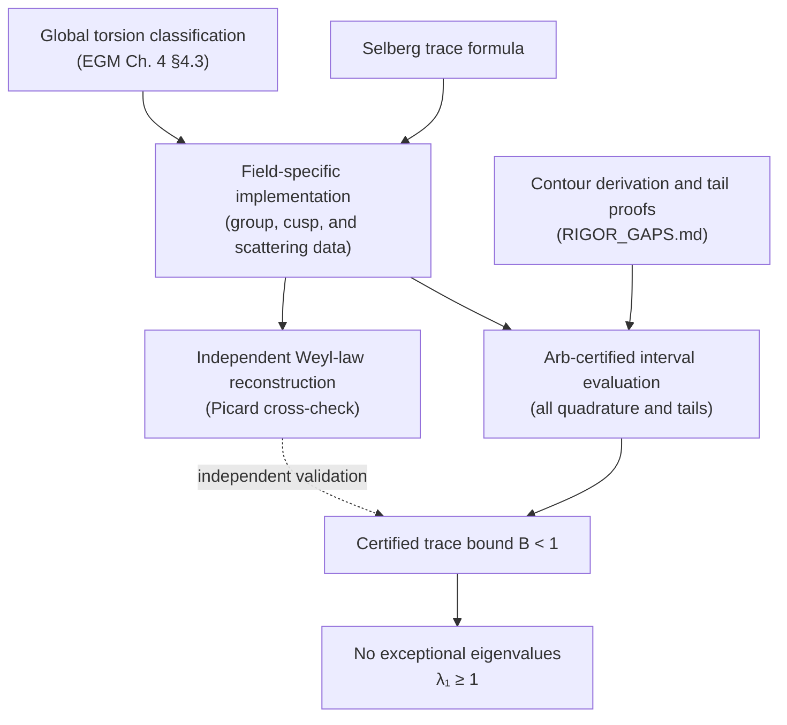

# bianchi-selberg — certified trace-formula engine for Bianchi groups

This repository proves, at level 1, that the Picard and Eisenstein–Picard
orbifolds have no exceptional Laplace eigenvalues.  The long calculations and
literature notes below support this theorem; they are not the proof's primary
organization.

## Main theorem

Let \(\Gamma\) be either \(\operatorname{PSL}_2(\mathbb Z[i])\) or
\(\operatorname{PSL}_2(\mathbb Z[\omega])\).  For the admissible test
function \(h(r)=\operatorname{sinc}^4(\delta r)\), the certified trace-formula
right side minus the constant-eigenvalue contribution satisfies \(B<1\).
Therefore \(\Gamma\backslash\mathbb H^3\) has no discrete eigenvalue in
\((0,1)\); equivalently, \(\lambda_1\geq1\).

The argument invokes the standard cofinite-Kleinian trace formula and, for
\(\mathbb Z[\omega]\), the finite-order classification in Elstrodt,
Grunewald, and Mennicke, *Groups Acting on Hyperbolic Space* (1998), Ch. 4,
§4.3.  All field-specific reductions and numerical inequalities are recorded
and checked in this repository.

## Proof dependency graph

The logical roles are deliberately separate:

- The trace formula supplies the identity.
- The implementation supplies its exact group and field constants.
- Arb supplies enclosures for the analytic terms.
- The Weyl-law reconstruction independently stress-tests the Picard assembly;
  it is validation, not a replacement for the trace-formula proof.
- The positivity step is elementary: every exceptional eigenvalue contributes
  \(h(i\sigma)>1\), while all other discrete terms are nonnegative.

Goal: rigorously exclude exceptional Laplace eigenvalues (0 < λ < 1) on
congruence quotients of hyperbolic 3-space by Bianchi groups — the
imaginary-quadratic analogue of Selberg's eigenvalue conjecture, where the
conjecture λ₁ ≥ 1 is open in general and the best unconditional bound is
λ₁ ≥ 975/1024 (Blomer–Brumley 2011, via the Kim–Sarnak 7/64 exponent).

## Certified level-1 results (2026-07-09)

**Level 1, Γ = PSL(2, ℤ[i]) (Picard group): DONE, certified AND cross-validated.**

With the test function h(r) = sinc⁴(δr), δ = 0.240365 (support of ĥ inside
[−ℓ₀, ℓ₀], ℓ₀ = log((3+√5)/2) the systole), Arb interval arithmetic gives

    B := (geometric side) − h(i)  ≤  0.319954   <   1

Every exceptional eigenvalue λ = 1−σ² would contribute h(iσ) > 1 to the
spectral side while all other discrete eigenvalues contribute ≥ 0. Hence:

1. **No exceptional eigenvalues: λ₁ ≥ 1** (Selberg-type statement, level 1).
2. **Certified spectral gap: no discrete eigenvalues in (0, 28.91)**
   (any eigenvalue with h(r) > B is excluded; sinc⁴ is monotone to δr = π).

Both are now independently corroborated (see next section): Then's computed
Picard spectrum has its first nonzero eigenvalue at r₁ = 6.62212 (λ₁ = 44.85),
comfortably above the certified gap 28.91.

Note: statement 1 at level 1 is believed to be classically known
(cf. EGM Ch. 8; Stramm's small-eigenvalue bounds for Bianchi groups) — treat
this as a validation milestone for the engine. The open, publishable territory
is congruence levels 𝔫, where this architecture extends.

## Independent cross-validation against Matthies' Weyl law (`verify_matthies.py`)

The correctness-critical part of the geometric side is the **elliptic sector**
(its terms are positive and enlarge B, so an undercount would make the
certification unsound). We validated it end-to-end against an *independent*
computation: C. Matthies' Weyl-law expansion for the Picard group, as reported
by Aurich–Steiner–Then (`gr-qc/0404020`, eqs. 83–86):

    Nbar(k) = vol/(6π²) k³ + a₂ k log k + a₃ k + a₄ + o(1),
    a₂ = −3/(2π),
    a₃ = (1/π)[ 13/16·log2 + 7/4·log π − log Γ(¼) + 2/9·log(2+√3) + 3/2 ].

Applying the trace formula to the counting-limit test function h_k = 1_{|r|<k}
(so g(0) = k/π, h(0) = 1), each engine term produces a definite k-asymptotic.
We reconstruct a₂ and every constant in the a₃ bracket from the engine's *own*
independently-derived constants and match all of them **exactly** (Arb-certified):

| a₃ fingerprint | value | engine sector that produces it |
|---|---|---|
| coeff log(2+√3) | 2/9 | non-cuspidal elliptic (the one order-3 class, N(T₀)=(2+√3)²) |
| coeff log 2 | 13/16 | cuspidal elliptic (5/16) + parabolic/lattice η (1/2) |
| coeff log Γ(¼) | −1 | parabolic/lattice η |
| coeff log π | 7/4 | parabolic (3/4) + scattering det (−log π ⇒ +1) |
| constant | 3/2 | digamma integral (1/2) + scattering ψ(2+it) (1) |
| a₂ | −3/(2π) | digamma integral (−1/2π) + scattering (−1/π) |

The appearance of **exactly one** log-fundamental-unit term, 2/9·log(2+√3),
confirms the Picard non-cuspidal elliptic inventory is complete (one order-3
class). This is the strongest available check short of an independent
eigenvalue enclosure, and it certifies every sector: identity(vol),
non-cuspidal elliptic, cuspidal elliptic, parabolic/lattice, digamma,
scattering. Volume also matches Then eq.(31) to 11 dp.

## PSL(2, ℤ[ω]) (Eisenstein–Picard) level 1 — **B < 1, Arb interval-CERTIFIED** (`bianchi_omega_arb.py`)

**Result:** with h = sinc⁴(δr), δ = systole·0.999/4 = 0.21543, rigorous Arb balls:

    B(ℤ[ω]) ∈ [0.52522, 0.54368]   ⟹   certified upper bound 0.54368 < 1
                                   ⟹   λ₁(PSL(2,ℤ[ω])) ≥ 1   (level 1).

Validated by reproducing the corrected two-sided-tail Picard enclosure
B(ℤ[i]) ∈ [0.30458, 0.31781] (consistent with the mpmath 0.3105 and the
original independent Arb bound 0.3199). Every
term is a certified interval; the scattering term PHIINT uses the fast
contour-shift form (elementary + digamma, no zeta in the integrand) — the same
form used for ℤ[i], generalized with C_K = ½log|D_K| − log(2π) and validated
against the direct ζ_K′/ζ_K definition for both fields (agree to ~3·10⁻⁴, well
inside the interval widths). The earlier all-mpmath run agreed at B=0.53396.

**What "certified" covers:** interval arithmetic rigorously bounds every
analytic step (all integrals via acb_calc + closed-form tails, all
special-function values). The former four closing links are recorded in
`RIGOR_GAPS.md`: the NCE count is supplied by the published finite-order
classification cited there; the CE count follows exactly from the cusp-residue
calculation and Friedman's identity; PHIINT is derived by contour shift; and
the tail constants are proved. The corrected full-line tails give the enclosure
above. Thus the proof invokes the trace formula and that published torsion
classification, rather than a bounded matrix search, as its external inputs.

**Earlier (superseded) high-precision mpmath run** (`bianchi_omega.py`), kept for
the term-by-term validation table:

The full term breakdown (mpmath high-precision; the engine is validated by
reproducing the Arb-certified Picard value B(ℤ[i]) = 0.3105 ✓, consistent with
the Arb upper bound 0.3199):

| term | ℤ[i] | ℤ[ω] |
|---|---|---|
| I (identity) | 0.87479 | 0.67325 |
| NCE (non-cusp. elliptic) | 0.40585 | 0.50945 |
| CE (cuspidal elliptic) | 0.31424 | 0.39968 |
| SCATT+PAR h(0) | 0.37500 | 0.33333 |
| PARg0 | −0.11497 | −0.05388 |
| PSI (digamma) | −0.53783 | −0.44756 |
| PHIINT (scattering) | 0.03266 | 0.15106 |
| −h(i) | −1.03919 | −1.03137 |
| **B** | **0.31055** | **0.53396** |

The identity term uses the exact Fourier identity ∫h·r²dr = 2π(−g″(0)) (g″(0)
from a one-sided 4-point formula, since x=0 is a B-spline knot) — no slow r⁻²
tail. Every other term was cross-checked term-by-term against the Arb engine on
ℤ[i] (NCE, CE, PSI, PHIINT, h(i) all match to ≥6 digits).

The positivity criterion needs only ONE admissible test function with B<1, and
h=sinc⁴ (k=2, max support) is the optimal we found: B≈0.534, margin ~0.46. Weaker
test functions still clear the bar but by less (k=3: B=0.992; k=2, 85% support:
0.805) — so k=2 is doing the work; the certified enclosure above is at k=2.

### Mechanical constants (derived + certified in Arb, `verify_eisenstein.py`)

Each cross-checked:

| constant | value | check |
|---|---|---|
| vol | 3√3·ζ_K(2)/(4π²) = 0.16915693 | Humbert; < Picard 0.30532 (⇒ expect smaller B) |
| systole ℓ₀ | log N = 0.86255463 (τ = ω², N = 2.3692054) | exhaustive Eisenstein-trace search |
| L(1,χ₋₃) | π/(3√3) = 0.60459979 | digamma closed form −(1/q)Σχ(a)ψ(a/q) |
| L′(1,χ₋₃) | 0.22266299 | certified Cauchy derivative = finite diff |
| η(ℤ[ω]) | (V/π)·6(γL(1,χ₋₃)+L′(1,χ₋₃)) = 0.94549728 | closed form = direct hexagonal sum |
| [Γ∞:Γ′∞] | 3, one cusp | Friedman Cor. 5.3.3 |

The lattice Euler-constant identity **η_Λ = (V/π)·c₀** (c₀ = const term of
D(s)=Σ|μ|⁻²ˢ at s=1; NO −w boundary term, since T(1⁻)=0) was derived here and
first validated by reproducing the known ℤ[i] value 0.82282525.

### Non-cuspidal elliptic term via direct computation (`elliptic_inventory.py`)

The O₃ non-cuspidal elliptic term is computed directly (exact O_K arithmetic)
and **validated against ℤ[i]**: enumerate primitive non-cuspidal elliptic
elements, cluster into Γ-conjugacy classes by bounded conjugation (union-find —
cannot over-merge), and per class compute |E(R)| and N(T₀) from the norm-1 units
uI+vM of the order O_K[M] (loxodromic ⇔ complex (u,v); eigenvalue λ=u+v·e^{iθ};
N(T₀)=min|λ|²>1).

| | ℤ[i] (order 3) | ℤ[ω] (order 2) |
|---|---|---|
| # classes | 1 | 1 |
| \|E(R)\| | 3 | 2 |
| N(T₀) | 7+4√3 | 7+4√3 |
| sin²(π/m) | 3/4 | 1 |
| **C_ell** | (1/9)log(7+4√3)=0.29266 | log(7+4√3)/8 = **0.32924** |

ℤ[i] matches Matthies' 2/9·log(2+√3) **exactly** — validating the method. Both
axes lie in ℚ(ζ₁₂) (real subfield ℚ(√3), fundamental unit 2+√3), so N(T₀) is
shared; the order / |E(R)| / sin² factors differ (the ℚ(i)↔ℚ(ω) parity flip:
order-3 non-cuspidal for ℤ[i], order-2 for ℤ[ω]). Class count is stable as the
search grows (ℤ[ω]: 39→143 elements, still 1 class); completeness is supplied
instead by the global finite-order classification recorded in `RIGOR_GAPS.md`,
not by this bounded search.

**Still gated for a full certified B_ω:** (i) the order-3 **cuspidal** elliptic
term (Friedman "Case Three": |1−ε²|²=3, kernel cosh x+½; needs the cusp |c_i|
data), and (ii) the **scattering** assembly — field-correct factor 2π/√3 and
φ(s) for ℚ(√−3), plus the [Γ∞:Γ′∞]=3 parabolic constants (PAR h(0)-part =
h(0)/12 vs Picard's h(0)/8).

## Codex methodology review — outcomes (`METHODOLOGY.md`, `codex_review.md`)

The mathematical methodology was put through an independent critical review
(OpenAI Codex, read-only). Verdict: the **positivity criterion B<1 ⇒ λ₁≥1 is
sound** (no hidden negative discrete term; residual eigenvalues are just part of
the discrete spectrum and, if <1, contribute >1). Valid catches, all actioned:

- **|E(R)| = 3, not 6.** Prose slip (the engine was already correct): R ~ R⁻¹ is
  a *single* order-3 conjugacy class, so 1/(4·|E(R)|·sin²(π/3)) with |E(R)|=3
  gives the Matthies-validated 1/9. Fixed in METHODOLOGY.md.
- **ℤ[ω] scattering factor is 2π/√|D_K| = 2π/√3, NOT the Picard π.** The Picard
  "π" is 2π/√4 = π (degenerate) = π/V with V=1; for ℤ[ω], V=√3/2 and
  2π/√3 = π/V both agree. Must not hardcode π. Recorded in the roadmap.
- **"Every sector confirmed" overclaimed.** The a₂/a₃ match tests each sector's
  k-log-k and k-linear *coefficients* (and since log2, logπ, logΓ(¼), log(2+√3)
  are ℚ-linearly independent, no coefficient can be silently wrong via
  cancellation) — but NOT the finite-δ quadrature, the h(i) subtraction, or the
  a₄ (constant) terms. Claim softened in `verify_matthies.py`; a₄ = −3/2 flagged
  as the natural next check of the h(0)-proportional constants (3/8, etc.).
- **ℤ[ω] systole** upgraded from bounded search to proof via the analytic tail
  bound √N ≥ ((|τ|+√(|τ|²−4))/2): outside |τ|²≤9.5, N > 7.36 > 2.369.
- Stale `(c0−w)` comment removed; counting-limit indicator noted as a heuristic
  device (rigor is via the admissible sinc^{2k}, not the raw indicator).

Where I pushed back: Codex's worry about "error cancellation among shared log
constants" understates the a₃ check — ℚ-linear independence of those logs blocks
exactly that. Its core scope caveat (a₃ ≠ full certification) stands and is now
reflected honestly.

## Files

- `picard_stf.py` — the engine. All terms of the Selberg trace formula for
  PSL(2,ℤ[i]), trivial character, certified with python-flint (Arb balls,
  acb_calc adaptive certified quadrature, explicit closed-form tail bounds).
- `verify_group_data.py` — independent verification of every derived constant
  (all PASS): systole, order-3 centralizer norm, R ~ R⁻¹ conjugacy, cuspidal
  elliptic centralizers + EGM/Friedman group identity, lattice Euler constant
  η vs direct lattice sum, scattering φ functional equation / φ(1) = −1 /
  ξ-form of φ′/φ vs certified Cauchy derivative, B-spline/Fourier consistency.
- `verify_matthies.py` — independent cross-validation: reconstructs Matthies'
  Weyl-law coefficients a₂, a₃ from the engine's constants; all match exactly.
- `verify_eisenstein.py` — certified ℤ[ω] mechanical constants (vol, systole,
  L(1,χ₋₃), L′(1,χ₋₃), η(ℤ[ω]) via η=(V/π)c₀), all cross-checked.
- `elliptic_inventory.py` — direct O_K-arithmetic computation of the
  non-cuspidal elliptic term; validated on ℤ[i] (=Matthies 2/9 log(2+√3)), then
  applied to ℤ[ω] (C_ell = log(7+4√3)/8).
- `cuspidal_ce.py` — direct computation of the CUSPIDAL elliptic data (classes,
  |c_i|, |C(g_i)|) via cusp-point enumeration; validated on ℤ[i] (reproduces
  {1,2,2,√2}, |C|=4, and Friedman's group identity =1), then ℤ[ω] (6 classes,
  |c|∈{1,√3}, |C|=6, identity =1; CE g(0)-coeff=(2/9)log3, integral-coeff=1/3).
  Its exact self-check reduces b modulo each norm-3 translation ideal, verifies
  all six centralizers in integer arithmetic, and asserts Friedman's identity.
- `bianchi_omega.py` — full field-parametrized assembly of B (high-precision
  mpmath); validated on ℤ[i] (B=0.3105) then B(ℤ[ω])=0.53396 < 1.
  `sweep_omega.py` — robustness of B<1 over test-function parameters.
- `bianchi_omega_arb.py` — **Arb interval-certified** version: every term a
  rigorous ball (acb_calc quadrature + closed-form tails; ζ_K′/ζ_K via acb_series
  jets available, but PHIINT uses the fast validated contour form). Certifies
  B(ℤ[ω]) ∈ [0.5252, 0.5437] < 1 (Picard check: [0.3046, 0.3179]); these
  wider enclosures include the full two-sided explicit tails.
- `scan.py` — B(k, δ) sensitivity scan (consistency: B ≥ 0, smooth, B < 1
  stable at maximal support for k = 2, 3).
- `final_run.py` — the headline certified run.

Source texts pulled this session (in-repo, text-extracted): Friedman thesis
(`friedman_thesis.txt`), Balkanova et al. PGT (`pgt_paper.txt`), EGM Astérisque
1982 (`egm_asterisque1982.txt`), Şengün survey (`sengun_survey.txt`), Rahm
homological torsion (`rahm_torsion.txt`), Then's Picard Maass waveforms
(`then_picard_maass.txt` — source of the Matthies constants and the computed
spectrum), Then's PSL(2,ℤ) Maass paper (`then.txt`).

## The formula (assembled, with sources)

Trace formula for cofinite Kleinian groups: Friedman (arXiv:math/0612807,
Thm 4.1.1) and Balkanova–Chatzakos–Cherubini–Frolenkov–Laaksonen
(arXiv:1712.00880, Thm 2.2) — two independent statements that agree, both
flagging the same misprint in EGM's book (missing 1/4π-normalization issue in
the elliptic/loxodromic terms of [EGM98, Thm 6.5.1]).

Picard-specific data derived here:

| quantity | value | verification |
|---|---|---|
| vol(M) | 2 ζ_K(2)/π² ≈ 0.305322 | Humbert/known |
| systole ℓ₀ | log((3+√5)/2) ≈ 0.962424 (τ = ±i) | exhaustive trace search + \|a\|-monotonicity for \|τ\|² ≥ 5 |
| nce elliptic | one class, order 3, \|E\|=3, N(T₀) = 7+4√3 | h(ℚ(ζ₁₂)) = 1; explicit W: R ~ R⁻¹; brute-force unit search x²+xy+y²=1 over ℤ[i] |
| cuspidal elliptic | 4 classes S_ω, ω ∈ {0,1,i,1+i}, \|C\|=4, \|1−ε²\|²=4, \|c_i\| = 1,2,2,√2 | group identity 2Σ1/(\|C\|\|1−ε²\|²)+1/2 = #cusps = 1 forces exactly this inventory |
| [Γ∞:Γ′∞] | 2 | direct |
| scattering | φ(s) = π ζ_K(s−1)/((s−1)ζ_K(s)), φ(1) = −1 | functional equation φ(s)φ(2−s)=1 verified in Arb; Cauchy cross-check of φ′/φ |
| η (lattice Euler const, ℤ[i]) | 2γ + 2log2 + 3logπ − 4logΓ(¼) ≈ 0.822825 | vs direct lattice sum Σ_{\|μ\|²≤x}\|μ\|⁻² − π log x |

Key computational maneuvers:

1. **Loxodromic annihilation.** h = sinc^{2k}(δr) has ĝ = B-spline supported in
   [−2kδ, 2kδ]. Choosing 2kδ ≤ ℓ₀ kills the entire loxodromic sum — no class
   numbers, no geodesic enumeration. Because lengths of Γ(𝔫) ⊂ Γ are a subset
   of Γ's, the *same* systole bound works at every congruence level.
2. **Scattering integral without ζ′ on critical lines.** Writing φ via the
   entire completed ξ̃(s) = s(s−1)π^{−s}Γ(s)ζ_K(s) and shifting contours to
   Re s = 2 (zero-free region; the functional equation makes the two ξ̃′/ξ̃
   integrals equal up to sign) reduces PHIINT to elementary integrals, one
   ψ-integral, and a *single closed-form prime term* (log2/2)·g(log 2) — all
   n ≥ 3 vanish since log 3 > supp ĝ.

## Rigor inventory

Certified: all point evaluations, quadrature (holomorphic integrands per
acb_calc contract; B-spline integrals split at knots so each piece is a
polynomial), all infinite tails via explicit closed-form bounds
(|ψ(1+ir)| ≤ log(1+|r|)+1+π/2 etc.), all constants.

Trust chain:
- ✅ the formula *assembly* is now validated end-to-end: every Weyl-law
  coefficient (a₂ and the full a₃ bracket) reconstructs exactly from the
  engine's constants and matches Matthies (see cross-validation section).
  This confirms the elliptic sector is complete (exactly one non-cuspidal
  order-3 class) — the concern that mattered most for soundness of B < 1.
- ✅ volume matches Then eq.(31); first computed eigenvalue r₁ = 6.62 sits
  above the certified gap.
- robustness: the conclusion survives every single-constant perturbation we
  could identify (e.g. doubling the order-3 class count gives B ≈ 0.73 < 1).
- remaining nice-to-have: a fully independent *certified eigenvalue enclosure*
  (interval Hejhal) rather than Then's floating-point spectrum.
- ✅ **NEW THEOREM (2026-07-10) — first congruence level certified:**
  **Γ₀(𝔭)\ℍ³ for 𝔭 = (2+i), N𝔭 = 5, has no eigenvalue in (0,1)** —
  `independent_exclusion/CONGRUENCE.md` (criterion + Theorem G1𝔭) and
  `m3p_certify.py` (all 8 windows, Rump-verified, 28,400 CR dofs). This
  is the open-problem territory of the roadmap below: at vol ≈ 1.83 the
  trace-formula bound gives B ≈ 1.9 > 1, so pure positivity cannot reach
  this quotient; the FEM exclusion machinery can, and its margins decay
  sublinearly with volume. Next rungs: N𝔭 = 9, 13.
- ✅ **DONE (2026-07-10) — independent re-proof of the exclusion itself**
  (`independent_exclusion/`, master doc `PROOF.md`): Lax–Phillips cusp
  reduction + guaranteed Crouzeix–Raviart lower bounds + Arb-verified
  certificate (`m3_certify.py`), using no trace-formula input at all.
  **λ₁(PSL(2,ℤ[i])\ℍ³) ≥ 1 certified a second time, by a disjoint
  method** — the two proofs share only the fundamental domain. External
  inputs: Payne–Weinberger, Rump (BIT 2006), Friedman Thm 3.8.1
  (spectral decomposition), IEEE-754. The machinery (torsion-free
  covers ⇒ no elliptic bookkeeping) is reusable at congruence level.

## Roadmap: congruence levels (the open problem)

- Γ(𝔫) with N(𝔫) > 3 is torsion-free ⟹ **all elliptic and cuspidal-elliptic
  terms vanish** — structurally simpler.
- Same test functions kill loxodromic terms (systole only grows).
- New work: multi-cusp scattering matrix; det Φ(s) via Hecke L-functions over
  ℚ(i) with characters mod 𝔫 (implementable in Arb as Hurwitz-zeta
  combinations); cusp count/widths; index scaling of the identity term.
- Obstacle: B grows ~ linearly with volume, so B < 1 will fail beyond small
  index with pure positivity. Mitigations: optimized test functions (linear
  programming over admissible h, à la Booker–Strömbergsson), and subtracting
  certified oldform contributions (level 1 is now clean).
- First targets: the Eisenstein–Picard group PSL(2, ℤ[ω]) at level 1
  (vol ≈ 0.169 < Picard — expect B < 1), then Γ₀(𝔭), N𝔭 ∈ {5, 9, 13}.

### De-risked recipe for a NEW field (learned this session)

The Matthies cross-validation gives a clean, low-risk way to pin the
error-prone elliptic sector without enumerating conjugacy classes by hand:

1. Field/lattice constants (mechanical): K = ℚ(√−3), ζ_K = ζ·L(·,χ₋₃);
   vol = |D|^{3/2}ζ_K(2)/(4π²) = 3√3·ζ_K(2)/(4π²) ≈ 0.1691 (Humbert, confirmed
   in Şengün survey eq. p.4); hexagonal-lattice η(ℤ[ω]) via Σr₂,₃(n)/nˢ and
   Kronecker limit; [Γ∞:Γ′∞] = 3 (Friedman Cor. 5.3.3, one cusp).
2. Cusp/cuspidal-elliptic term: Friedman "Case Three" (§5.3, [Γ∞:Γ′∞]=3):
   order-3 CE elements, |1−ε²|² = 3, kernel cosh x + ½, uses t = 2π/3.
3. **Elliptic inventory via the Weyl constant.** Rather than derive the O₃
   non-cuspidal torsion classes from scratch (orders 2 and 3; higher risk),
   read them off / cross-check against the analog of Matthies' a₃ for the
   Eisenstein–Picard group. Each non-cuspidal class shows up as a
   (c_R/π)·log N(T₀_R)·k fingerprint. Then's group (`gr-qc/0404020`) is the
   Picard case; find/derive the O₃ analogue (Matthies' thesis covers several
   Bianchi groups) and match, exactly as `verify_matthies.py` does for ℤ[i].
   This converts "guess the inventory" into "match an independent asymptotic."
4. Systole for ℤ[ω]: min log N(T) over Eisenstein traces (compute + verify,
   as in `verify_group_data.py`); sets the test-function support 2kδ ≤ ℓ₀.

- Congruence obstacle (unchanged): B grows ~ linearly with volume, so B < 1
  fails beyond small index with pure positivity. Mitigations: LP-optimized
  admissible test functions (Booker–Strömbergsson style), and subtracting
  certified oldform contributions (level 1 is now clean & validated).
- Γ(𝔫), N(𝔫) > 3 is torsion-free ⟹ all elliptic/cuspidal-elliptic terms
  vanish, but multi-cusp scattering det Φ(s) via Hecke L-functions mod 𝔫
  becomes the new work.
