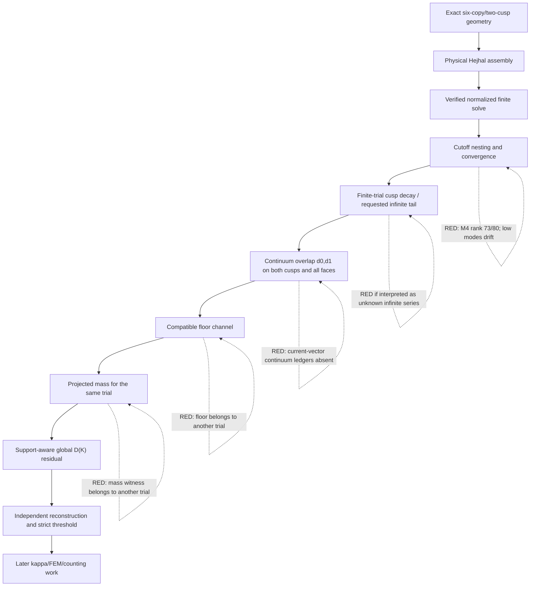

# Track B global Hejhal defect audit

Date: 2026-07-15

## Outcome

`global_hejhal_defect_certified=false` and `rung4_certified=false` remain the
only defensible states.  The stalled run was not a slow continuum integrator:
the artifacts fail compatibility and cutoff-convergence prerequisites before
a global continuum total can be formed.

The exact theorem defect is now frozen as

\[
 R=\|(\Delta-\lambda)U\|_{L^2(X;\mathbf C^6)},\qquad
 R\le \tau+\|B_0d_0+B_1d_1\|_2,
\]

with hyperbolic volume `dx1 dx2 dy/y^3`, the hyperbolic covector norm for
first gradients, `lambda=1+r^2`, and `tau=0` termwise for a finite Whittaker
field.  The canonical definition hash is

```text
9bf39d5964642e2e4078de002f3465fb635b634e0db84d0569b0942ce26ef6a0
```

The source theorem is explicitly marked “Working draft, 2026-07-13”.

## Pipeline and first uncertified assumptions



Geometry, the finite M=1 physical assembly, and its independent physical-row
verification are certified.  The first new failure is cutoff convergence.
The next independent failures are artifact identity at the floor and mass
channels and absence of continuum ledgers for the new vector.

## Cutoff ladder evidence

All comparable runs below use the same six exact collocation points and
normalization `a_infinity,(1,0)=1`.

| M | unknowns | rows | verified solve | sigma-min lower | contraction upper | physical L2 residual |
|---:|---:|---:|:---:|---:|---:|---:|
| 1 | 24 | 144 | yes | 3.737e-3 | 1.887e-13 | 5.049e-5 |
| 2 | 44 | 144 | yes | 1.150e-6 | 1.419e-9 | 2.138e-4 |
| 3 | 52 | 144 | yes | 1.191e-5 | 6.754e-11 | 1.271e-4 |
| 4 | 80 | 144 | no | — | — | — |

The exact nesting maps are label-preserving sparse embeddings.  Independently
solved low modes do not stabilize:

```text
delta_1,2 L2 upper = 3.143177623272475...
delta_2,3 L2 upper = 3.292376178684900...
```

These changes are order one despite the fixed normalization.  The physical
residual is also non-monotone.  There is therefore no numerical evidence of
cutoff convergence in the present formulation.

At M=4, the 145-by-80 physical-plus-normalization midpoint matrix has rank 73
at the standard numerical threshold `3.22e-14`.  Seven singular values are at
roughly `1e-18` to `1e-21` in one SVD evaluation; the corresponding directions
are concentrated in the newly introduced infinity norm-4 modes and cusp-zero
norm-16 through norm-20 modes.  This is a collocation/constraint observability
failure, not an interval-precision failure: the gap from the last resolved
singular value (`1.57e-9`) to the null cluster is about nine orders of
magnitude.  Adding Arb precision cannot create the missing independent rows.

## Tail interpretation

For the finite Whittaker field used by D(K), all coefficients outside the
recorded mode list are exactly zero by definition.  Its formal Fourier tail
and derivative tails are therefore exactly zero; every retained Bessel value
is still evaluated directly in Arb.

The requested tail relative to an unknown infinite automorphic expansion is a
different object.  It is not certified because the repository contains
neither the omitted coefficients nor a proved coefficient-growth envelope.
Bessel exponential decay alone cannot bound an arbitrary coefficient
sequence.  No decay assumption has been inserted.

## Incompatible certified artifacts

The closed floor and projected-mass certificates use

```text
trial: six_copy_hejhal_balanced_coeffs.json
M_infinity=8, M_zero=40
r=6.62208
```

The new physical trial uses

```text
M=1
r=6.7439020359331625
coefficient_vector_hash=549511efb90233d9dacdd3f9c8e299d597603b079eb34001c32e43e596b9105e
```

The plateau proposition certifies mass for the fixed recorded projected
trial.  It does not transfer the lower bound to another coefficient vector.
Consequently the number `0.010190340500424547` is not an admissible global
threshold for the new trial.  The threshold-producing formula is valid,
`R_allowed=mu_target*0.1/2`, but `mu_target` is unset until mass is certified
for the same field.

The standalone floor artifacts also dropped their source trial hash during
certificate extraction.  Future floor and stability outputs now preserve
`trial`, `trial_sha256`, and the spectral parameter; existing certificates
must be regenerated to acquire that provenance.

## Ranked bottlenecks

1. **Trial identity is split across two branches.**  The new physical solve,
   old floor certificate, and old projected-mass witness are not the same
   field.  This alone prevents a theorem threshold and global aggregation.
2. **The cutoff solve is not convergent/observable.**  M=4 is rank deficient,
   and M=1–3 low coefficients drift by more than 3 in L2.
3. **No continuum d0/d1 certificate exists for the new coefficient hash.**
   Neither cusp continuum channel nor the four non-floor pairing faces can be
   imported from old scalar diagnostics.
4. **The requested unknown-series tail has no mathematical coefficient
   bound.**  It should be removed as a D(K) prerequisite or supplied with an
   explicit proved coefficient envelope; it cannot be guessed numerically.
5. **Reprojection is incomplete.**  Solver-to-physical-verifier equality is
   hash-bound, but solver-to-continuum and solver-to-floor equality is not.

## Smallest credible next changes

1. Choose one canonical trial branch.  The least disruptive route is to run
   the corrected physical two-cusp assembly at the exact `r`, mode space,
   projection, and normalization used by the existing mass/floor trial, or to
   regenerate both mass and floor for the new trial.  Mixing them is invalid.
2. Add more exact, non-symmetric collocation points and certify the M=4 rank
   before any continuum integration.  The acceptance test is a verified
   normalized solve plus materially smaller low-mode differences at M=3,4;
   merely increasing precision is not responsive to the observed nullspace.
3. Once a cutoff pair stabilizes, construct both-cusp and all-face continuum
   ledgers using the same coefficient-to-field-map hash.  Preserve shell and
   symmetry cancellation before interval absolute values, as in the floor
   Taylor implementation.
4. Regenerate the floor certificate for that exact field and require its
   `trial_sha256`, spectral parameter, partition hash, theorem hash, and field
   map hash to match.
5. Recompute the plateau mass for that same projected field.  Only then form
   `R_allowed` and perform the support-aware global aggregation.

Closure probabilities are not estimated: the current ladder is divergent and
the compatible continuum channel magnitudes have not been computed, so a
numeric probability would not be evidence-based.  The changes above are
necessary conditions, not claims of sufficiency.

## Implemented audit artifacts

- `track_b_theorem_defect.py` and `track_b_theorem_defect_definition.json`
- `track_b_cutoff_ladder.py` and `track_b_cutoff_ladder_result.json`
- `track_b_cutoff_M4_rank_audit.json`
- `track_b_two_cusp_tail.py` and `track_b_two_cusp_tail_result.json`
- `track_b_global_hejhal_defect.py` and `track_b_global_hejhal_defect_result.json`
- `track_b_global_hejhal_verify.py` and `track_b_global_hejhal_verification.json`
- `test_track_b_global_hejhal.py`

The independent verifier reconstructs no total while a required channel is
missing.  Fourteen structural/fail-closed tests cover every requested forced
failure.  The later kappa bridge, independent FEM overlap, and counting work
remain separate and untouched.
